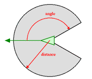

# Flocking birds Simulation in C++

## Table of Contents

- [I.   Introduction](#Introduction)
- [II.  Build](#Build)
   - [Running the program](#running-the-program)
- [III. Work methodology](#work-methodology)
- [IV.  Code Developement](#code-developement)
    - [Agents](#Agents)
    - [Neighborhood](#neighborhood)
    - [Laws](#Laws)
    - [Commands](#commands)
    - [Optimization](#Optimization)
- [V.   Testing](#Testing)
- [VI.  Continuous Integration](#CI)
- [VII. Conclusion](#Conclusion)


<a name="Introduction"/>

## I.   Introduction

Inspired by Craig Reynolds birds program, this project is a C++ application that simulate the behavior of flocking agents ( Birds ). They are simple agents that react to their local environment based on 3 fundamental rules :

- **Separation:** Agents try to avoid crowding their nearby flockmates.
- **Alignment:** Agents head towards the average heading of nearby flockmates.
- **Cohesion:** Agents try to move towards the center of mass of nearby flockmates.


<a name="Build"/>

## II.   Build

After cloning the project from the Gitlab repository, these commands should be ran in the root folder.

### Windows
```
mkdir build
cd build
conan install ..
cmake \
    -DCMAKE_TOOLCHAIN_FILE=conan_paths.cmake \
    -DCMAKE_GENERATOR_PLATFORM=x64 \
    ..
cmake --build . --config "${MODE}"
ctest -C "${MODE}"
```

### Docker

Using image hpwxf/hpc-ai-2021:conan-clang10

```
sudo apt update && sudo apt install -y libgtk2.0-dev libgl1-mesa-dev
conan profile new default --detect
conan profile update settings.compiler.libcxx=libstdc++11 default
mkdir build && cd build
conan install ..
cmake -DCMAKE_TOOLCHAIN_FILE=conan_paths.cmake -DCMAKE_BUILD_TYPE=Debug ..
cmake --build .
ctest

```

<a name="running-the-program"/>

### Running the program

When built, the executable file to launch is **life-of birds.exe**. Can be run after Cmake configuration on Visual Studio.
The program is generated with a flock of agents and predators, defined in the constants.hpp.

<a name="work-methodology"/>

## III. Work methodology

Following an Agile methodology, our project was developped through :
- *Extreme Programming :* Aims to produce higher quality software, and higher quality of life for the development team. XP is the most specific of the agile frameworks regarding appropriate engineering practices for software development.
It implements a simple, yet effective environment enabling teams to become highly productive. The team self-organizes around the problem to solve it as efficiently as possible.
Extreme Programming improves a software project in five essential ways; 

| XP |
| ------ |
|*Communication*|        
|*Simplicity*|        
|*Feedback*|
|*Respect*|
|*Courage*|


- *Pair programming* : The peer programming method is mostly used for agile software development.
Two people work simultaneously on the code, one writes the code while the other checks it in real time.


<a name="code-developement"/>

## IV.  Code Developement
### Class Dvec

This class handles Mathematic operations for 2-D vectors.
It is used mainly to store coordinates of Agents :

- Operator :  `+, -, *, /, ==, !=`
- scalar product.
- normalize vector.
- vector magnitude.
- vector dot product.


<a name="Agents"/>

## Agents

A group of Agents is a vector of elements of type Agents. The *Class Agents* contains most of the other objects in the project. It hosts all of the birds and predators' characteristics.

An Agent has mainly :

- Three Vertexs *[v1,v2,v3]* , which take two parameters, position and color, to move and display the birds as triangle when instantiated. 
- An Agent's Center and speed ( Center of triangle )-
- The agents angle and Index (ID)
- boolean prediator;
- boolean Agent alive;

The position of each bird and predator is randomly choosen, whereas the size, range, view angle and speed are set to constant values.


<a name="neighborhood"/>

## Neighborhood

We define an agent's neighberhood as the group of other agents with which it will interacts.
An agent [i] will be in the neighberhood of [J] only if it satisifies two rules :
- 1- Distance between [i] and [j] : the distance between them should be less or equal to the distance defined as the neighberhood radius.
- 2- Visibility of [i] to [j] : [i] should be in the range of vision of [j].




To calculate the neighberhood of an agent I, we tried two methods :

*The first method :*

- Calculating the distance between 2 agents' center [i1] and [i2] , and nearby birds are considered. This iteration has a O(n2) complexity.

*The second :* 

To optimize efficiency, We opted for Nearest Neighbor Search Using a Kd-Tree.
The Kd-tree divides a number of birds per node, based on coordinates, and partitions the birds in space so that when each boid is updated, the closest join the neighberhood.

To find the k-nearest neighbors to a given point:

- Determine the node to which the query point belongs.
- Find the closest k points within that node and its distance to the query point.
- Choose all other nodes having any area that is within the same distance, in the given direction, from the query point to the kth closest point. 
- Searche nodes within that range for any points closer to the query point.

<a name="Laws"/>

## Laws

The birds are devided into two Groups, personalized by the color :

- The seperation will be aplied on all agnents.
- escape_prediator applied to all agents except prediators, and hunting applied to all prediators on all the other agents.
- cohesion and alignment applied on each group of agents separtly.


| Agent | Laws |
| ------| ------ |
| Bird  |  separation |
|       |  alignment |
|       |  cohesion |
|       |  escape_prediator |
| predator   |  hunt  |
|            |  prediators_separation |
|            | eat   |


- **separation / prediators_separation :** Prevents Agents from colliding with their flockmates. Every flockmate within the avoidance range forces the other agent to move away from that flockmate. This rule has shortest range and the highest impact on their behaviour. The closer the agent is to a flockmate, the stronger the avoidance force is felt. 

- **alignment :** causes birds that are part of the same flock to have the same general direction. For every flockmate within the alignment range, a  will feel a force to match its heading to that of the flockmate. If there are multiple flockmates in the alignment range, the boid tries to move towards the average direction of those flockmates.

- **cohesion :** makes birds move towards the center of the group of flockmates that they can see. Each birds feels a gravitational force towards the center of all flockmates in its approach range. This rule makes sure that birds will not drift out of the group. 

- **escape_prediator :** Steers the birds away from the predators.

- **hunt :** is responsible for the predator chasing the birds. If there are birds in the predator's view angle and range, a random prey is chosen to be the focus of the chase at each time step. The predator will intersect the bird at its next position.

- **eat :** If the predator gets close enough to its prey, it will *feed* from it.

Respacting these laws, the birds direction is then set by an advance and rotate angle.


<a name="commands"/>

## Additional Feature

The simulation is interactive ; Left-clicking on the screen will revive the eaten birds.


- **FPS** Frames per second, calculates the number of pictures the program shows per second ~ (60/s).
```
frameCount++;
```
If a second has passed.
```
if (currentTime - previousTime >= 1.0) { 
```

We display the frame count here

``` 
std::cout << "Current FPS : " << frameCount << '\n';
frameCount = 0;
previousTime = currentTime;`
```


<a name="Optimization"/>

## Optimization

- Parallelization using OpenMP for some  parts of the code
*Exemples :* A neighberhood parallelization that leads to further speedups (and therefore the ability to simulate a larger number of birds).


<a name="Testing"/>

# V.   Testing

*Tests must be able to detect bad behaviors among good ones*


- **Functions testing the agents behavior :**
```
Rotate : To check if the Agent rotates correctly.
```
```
Advance : To check if the Agent moves.
```
```
Visibility : To check if an Agent can see another one. Exemple : Agents in red are visible while those in green are not.
```


```
Keep_in : To check if the Agents come from the other side of the screen.
```


```
Agent.updateNeighbors : To check if the neighborhood is updated

```

- **Eating Law :**
```
Laws.Eat : To check if a predator eats the correct Agent. 
```
*The result of testing (Ctest compilation)*


<a name="CI"/>

# VI.   Continuous Integration

## Git management

The first step of our project was to plan the application cycle. The branches in the Gitlab were created accordingly, where each had a specific function. 
The branche with the highest commits is then merged into the **master**, only if the program is reviewd, stable, and can easily be compiled . This helps separate the final program, and the additional developments on other branches.

## CI Pipeline

To minimize errors, and maintain a consistent process during the application's developement, an automated pipeline was set to build, test and deploy the code.

We started by using the Docker image ```hpwxf/hpc-ai-2021:conan-clang10```.

After pushin a work on a branch, the new pipeline is triggered, the code is compiled, and tests are run. In a merge request process, if the pipeline has not succeeded, the request is blocked until someone pushes a commit to fix the issue. This workflow allows a continuous code. 


## Docker

In order to run the builds in Continuous Integration Pipelines, docker images are needed in order to execute the commands of the pipeline. Namely the different stages needed are : 
- The installation of the dependencies with conan
- The building job with various compilers
- Executing the tests

<a name="Conclusion"/>

# VII.   Conclusion

- Application parallelization (TBB & OpenMP)
- More possible tests
- New features
